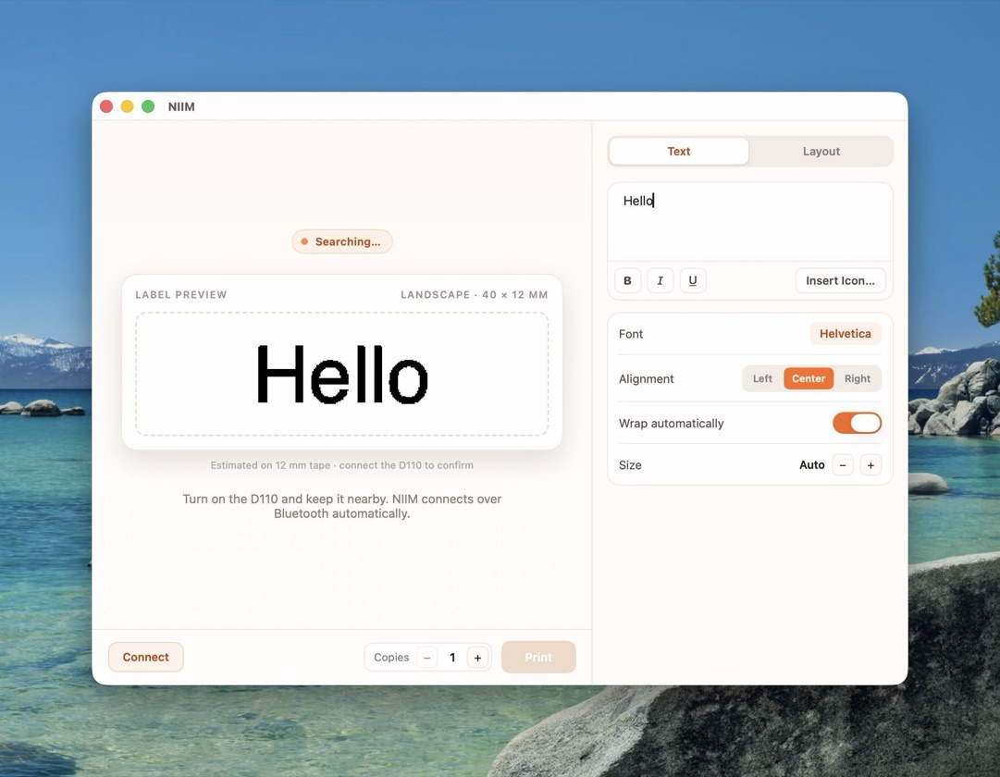
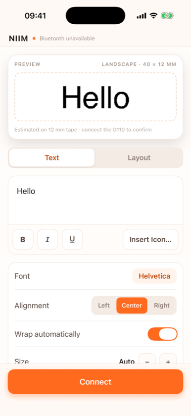

# NIIM

A native iPhone and Mac app for the **Niimbot D110** label printer, talking to it directly over Bluetooth LE instead of through the official app.

Not affiliated with NIIMBOT.

<p align="center">
  
  
</p>

## Features

- **Connects on launch.** Reads the loaded roll's RFID tag and looks up its size in Niimbot's public label database, so there's nothing to configure.
- **Text that fits.** Each section's text is sized as large as it fits, wrapping between words (or only at your own line breaks). Nudge the size up or down, and align left, center or right.
- **Rich text.** Bold, italic and underline per word, with the B / I / U buttons or ⌘B / ⌘I / ⌘U. Fonts without a real bold or italic face get a synthesized one.
- **Fonts.** Any system font or Google Fonts family (downloaded on first use and cached), with recently used fonts at the top of the picker.
- **Icons and emoji.** A searchable Font Awesome 7 Free icon picker. Emoji print with the monochrome Noto Emoji font, which comes out far cleaner on a thermal printer than color emoji.
- **Layouts.** Landscape or portrait, split into 1–6 sections that repeat one text (n-up) or each get their own.
- **Live preview** of exactly what will print, at the label's true proportions (a 40 × 12 mm estimate until the printer reports its roll), and copies.
- **Knows the roll.** Shows its material in your language (e.g. "Transparent Thermal Paper"), draws transparent rolls see-through and cable labels with their fold and tail, and starts with one section per text area the roll defines.

## Requirements

- macOS 26 or iOS 26 (the app uses SwiftUI's rich text editor)
- Xcode 26
- [XcodeGen](https://github.com/yonaskolb/XcodeGen): `brew install xcodegen`
- An Apple developer team to sign with (and a Developer ID Application certificate for `make release`)
- For the Python prototype only: [uv](https://docs.astral.sh/uv/)

## Setup

The signing team isn't in the repo. Create `Config/Local.xcconfig` (it's ignored by git):

```
DEVELOPMENT_TEAM = YOUR_TEAM_ID
```

`Niim.xcodeproj` is generated from `project.yml` and also isn't committed.

## Build and run

| Command | What it does |
|---|---|
| `make deploy` | Release build, replaces `/Applications/Niim.app` and launches it |
| `make release` | Universal Release build, archived and exported with Developer ID signing into `build/export/` |
| `make dmg` | That build packaged as a signed `build/Niim-<version>.dmg`, with an Applications shortcut to drag onto |
| `make notarize` | Builds the DMG, submits it to Apple's notary service, and staples the ticket |
| `make publish` | Checks for uncommitted changes, notarizes, tags `v<version>`, pushes, and creates a GitHub release with the DMG |
| `make iphone` | Builds for iPhone, installs on the first paired iPhone (or `DEVICE=<name>`) and launches it |
| `make test` | Runs the `NiimKit` unit tests |
| `make clean` | Deletes `build/` |

The version comes from `MARKETING_VERSION` in `project.yml`; bump it before `make publish`.

**Notarization setup (once).** Create an app-specific password at [account.apple.com](https://account.apple.com) → Sign-In and Security → App-Specific Passwords, then store it in the keychain:

```sh
xcrun notarytool store-credentials niim-notary --apple-id <your Apple ID> --team-id <your team ID>
```

Use a different profile name with `make publish NOTARY_PROFILE=<name>`.

**iPhone:** `make iphone` works over Wi-Fi once the phone is paired with Xcode and has Developer Mode on. Keep the phone unlocked while it launches. Or open `Niim.xcodeproj`, pick your iPhone and press Run.

Allow Bluetooth when asked. The printer can only hold one connection, so disconnect it from the official app first.

## Python prototype

`niim.py` is the script the protocol was worked out with. It's a single-file uv script:

```sh
./niim.py info    # printer model, firmware, battery, serial, and the loaded roll's RFID tag
./niim.py test    # prints a 30 mm test label
./niim.py calib   # prints 1 mm rulers at both ends, to measure clipping
```

macOS grants Bluetooth to the app that launched the process. Run it from a terminal app that has Bluetooth permission in System Settings → Privacy & Security, and not from inside a detached session such as a background multiplexer.

## Project layout

| Path | Contents |
|---|---|
| `NiimKit/` | Swift package shared by both apps: packet codec, bitmap rows, RFID parsing, label lookup, text layout, fonts, and the CoreBluetooth `Printer` |
| `App/` | SwiftUI app: `ContentView.swift` (preview, text and layout tabs), `Theme.swift` (colors and styled controls), `Pickers.swift` (font and icon pickers) |
| `project.yml` | XcodeGen spec for the iOS + macOS app target, including the build step that names the macOS menu bar NIIM |
| `docs/` | README screenshots |
| `Config/` | `Signing.xcconfig`, which includes your untracked `Local.xcconfig` |
| `tools/make-icon.swift` | Regenerates the app icon from `tools/niim-logo.png` |
| `niim.py` | Python/bleak protocol prototype |
| `Makefile` | Release build and deploy |

## D110 protocol

Based on [niimbluelib](https://github.com/MultiMote/niimbluelib)'s `D110PrintTask`, and verified on a D110 (model ID 2304).

**Connection.** BLE service `e7810a71-73ae-499d-8c15-faa9aef0c3f2`, one characteristic with notify and write-without-response. Notifications can split or merge frames, so reassemble them.

**Frame.** `55 55 cmd len data… checksum aa aa`, where the checksum is the XOR of `cmd`, `len` and every data byte. Commands with no arguments send the payload `01`. Most requests get a reply with a fixed response command; the printer also sends unsolicited `D3` check-line packets during a print, which can be ignored.

**Print sequence.**

| Step | Request | Data | Reply |
|---|---|---|---|
| Connect | `C1` | `01` | `C2` |
| Density | `21` | 1–3 | `31` |
| Label type | `23` | the roll's type from its RFID tag: `01` gaps, `05` transparent (niimbluelib's `LabelType`) | `33` |
| Print start | `01` | `01` | `02` |
| Print clear | `20` | `01` | `30` |
| Page start | `03` | `01` | `04` |
| Page size | `13` | rows u16, columns u16 | `14` |
| Copies | `15` | u16 | `16` |
| Rows | `85` / `84` | see below | none |
| Page end | `E3` | `01` | `E4` |
| Status (poll) | `A3` | `01` | `B3`: page u16, print %, feed %, error at byte 8 |
| Print end | `F3` | `01` | `F4` |

Poll status every 300 ms until the page counter equals the number of copies and both percentages are 100. All integers are big-endian.

**Rows.** The head is 96 dots (12 mm at 203 dpi, so 8 px/mm), and each row is 12 bytes, most significant bit first, 1 = black. A bitmap row is `85` with the row number (u16), the black-pixel count of each third of the head (3 bytes), a repeat count, and the 12 bytes. A blank row is `84` with the row number and repeat count. Identical consecutive rows are merged with the repeat count.

**Orientation.** Rows run along the feed. A label designed landscape (long side horizontal) is rotated 90° clockwise before sending; a portrait design with the start end at the top already matches.

**Info.** `40` + info type replies with `40` + type: `08` model ID, `09` firmware, `0A` battery, `0B` serial. `1A` reads the roll's RFID: 8-byte UUID, length-prefixed barcode, length-prefixed serial, total labels u16, used u16, label type.

**Label size.** The RFID tag has no dimensions. Look them up by barcode: `POST https://print.niimbot.com/api/template/getCloudTemplateByOneCode` with body `{"oneCode": "<barcode>"}` and header `niimbot-user-agent: AppVersionName/999.0.0`. `data.width` and `data.height` are in mm.

The reply carries more than the size:

- **Cable labels** have `isCable: true`, `cableLength` (the unprintable tail in mm, not included in `width` × `height`) and `cableDirection`. On a T12.5\*74+35 roll, `1` means the tail comes after the print area.
- **`inputAreas`** lists the template's text areas as `x`, `y`, `w`, `h` in mm, in the same frame as `width` × `height`. The cable roll has two, one either side of a fold. A 35 × 13 mm luminous roll has one covering almost the whole label.
- **`paperType`** matches the tag's label type (`1` for gaps, `5` for transparent).
- **`consumableType`** is the material code and **`consumableTypeTextId`** its key in NIIMBOT's language packs, `https://oss-print.niimbot.com/public_resources/static_resources/languagePack/<lang>.json` (en, ja, ko, de, fr, es, it, pt, ru, zh-cn, zh-cn-t, th, vi, ar). The name is `lang.<id>.value`; it's empty where untranslated, and `desc` holds the Chinese original. For example 19 is "Transparent Thermal Paper", 30 "Thermal paper - Wear-Resistant", 52 "Fluorescent Paper".
- **No color field.** Color only appears inside some material names ("Thermal Paper - Red Text"). `elements[].elementColor` belongs to an attached sample design, not the roll.

**Calibration.** The D110 loses about 1 mm at the start of each label, so the renderer keeps a 12 px margin.

## Gotchas

- **Emoji:** CoreText substitutes Apple Color Emoji for any sequence containing U+FE0F, even when another font is set explicitly. Strip U+FE0F before assigning Noto Emoji.
- **macOS sheets:** a sheet sizes itself to its content, and a `List` has no ideal height, so it collapses. Give the sheet an ideal size.
- **Swift Testing:** concurrent `CTFontDescriptorCreateCopyWithSymbolicTraits` calls from the parallel test runner hang in the font service, so `NiimKit` serializes them with a lock.
- **Icon source:** CoreGraphics treats an untagged palette PNG as Display P3 and oversaturates it when converting to sRGB; `make-icon.swift` reads the raw palette instead.
- **Menu bar name:** a generated Info.plist always sets `CFBundleName` to the product name ("Niim"), overriding a merged `INFOPLIST_FILE`, and there's no `INFOPLIST_KEY_CFBundleName`. A post-build script sets it to NIIM instead. It lists the Info.plist as an input so it's ordered before code signing; without that, a build came out with an invalid signature.
- **Initial focus on macOS:** `.defaultFocus` loses to the first focusable control (the Text/Layout tabs). Setting the `@FocusState` from the text editor's `.task` works.
- **Pulsing dot:** `phaseAnimator` never stops animating, and it also animated the dot's position when the layout moved, so the status dot slid slowly whenever the preview changed size. `.symbolEffect(.breathe)` pulses without touching layout.
- **Simulator:** it has no Bluetooth, so the app shows "Bluetooth unavailable" and can't connect. Use a real device to print.

## Credits

- Protocol: [MultiMote/niimbluelib](https://github.com/MultiMote/niimbluelib)
- Icons: [Font Awesome Free](https://fontawesome.com/license/free) (icons CC BY 4.0, fonts SIL OFL 1.1), downloaded at runtime
- Fonts: [Google Fonts](https://fonts.google.com), including [Noto Emoji](https://fonts.google.com/noto/specimen/Noto+Emoji), downloaded at runtime
